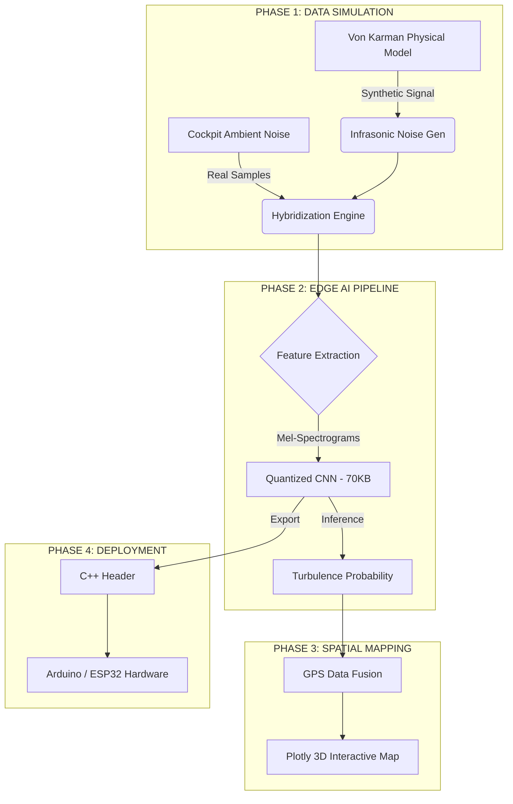

# 🏗️ Architecture du Système TurbulenceWatch

Ce document présente les diagrammes d'architecture du projet, utilisant le format Mermaid.

## 📡 Flux de Données Global (Data Pipeline)

## 🧠 Structure du Modèle CNN (TinyML)

## 🛠️ Stack Technique
- **Logiciel** : Python, TensorFlow, Plotly, Scipy, Librosa.
- **Matériel Cible** : ARM Cortex-M4 / ESP32.
- **Format d'Export** : TFLite INT8 / C++ Header.
